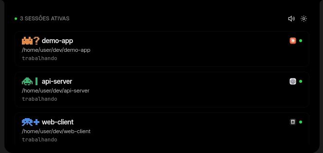

# Open Island

Open Island é um painel que fica colado na barra do topo do Hyprland e mostra o que os seus agentes de código estão fazendo agora: sessão, projeto, agente, modelo, terminal e tempo decorrido. Quando um agente pede uma permissão ou faz uma pergunta, a ilha expande e você responde ali mesmo, sem procurar em qual terminal aquela sessão está.



**A interface é só em português do Brasil.** Não existe tradução para outros idiomas e não existe opção para trocar de idioma.

## Instalação

```sh
curl -fsSL https://raw.githubusercontent.com/matheus-cintra/open-island/master/install.sh | sh
```

O script escolhe a rota conforme a sua distribuição: `.deb`, `.rpm` ou o tarball. O `.deb` e o `.rpm` instalam em `/usr/bin`; o tarball instala em `~/.local`.

O daemon e a ilha sobem no login por duas units de usuário do systemd, `open-islandd.service` e `open-island.service`, escritas em `~/.config/systemd/user`.

Na primeira vez que o daemon sobe ele configura sozinho os hooks dos agentes que encontrar instalados. Se você remover um hook depois, ele não volta.

## Requisitos

- **Wayland com Hyprland.** Não é opcional, veja a seção abaixo.
- **Sessão de usuário do systemd.** As duas units são `--user`, e o script chama `systemctl --user`.
- **PipeWire**, para os sons. O daemon toca os avisos com `pw-play`. Se `pw-play` não existir a instalação continua e só os sons ficam de fora.

## O que não é suportado, e por quê

**Só Hyprland, no Wayland.** Nenhum outro compositor funciona hoje, por três acoplamentos diretos:

- O sensor de ponteiro que faz a ilha expandir no hover abre o socket de eventos do Hyprland. Sem `HYPRLAND_INSTANCE_SIGNATURE` no ambiente ele sai na primeira linha e a ilha nunca expande sozinha (`app/src-tauri/src/lib.rs:91-94`, `app/src-tauri/src/hypr.rs:5-13`).
- O clique para pular para a sessão manda `hyprctl dispatch focuswindow address:…` (`app/crates/open-island-core/src/jump.rs:126`). Existe um fallback por X11, mas ele só enxerga janelas XWayland (`app/crates/open-island-core/src/focus.rs:117-124`).
- A altura da ilha é a altura reservada pela sua barra, lida do Hyprland.

**GNOME não roda.** O Mutter não implementa `zwlr_layer_shell_v1`, e a ilha é uma janela de layer shell na camada de overlay. Sem esse protocolo a janela é recusada na inicialização com `wlr-layer-shell is not available on this compositor` (`app/src-tauri/src/layershell.rs:31-33`).

**X11 não roda.** O protocolo de layer shell não existe no X11.

**sway, river, Wayfire e KDE ainda não são suportados.** Nenhum dos quatro foi testado, e mesmo onde a janela aparecesse o hover, o clique para pular e a altura colada na barra continuariam falando com o socket do Hyprland.

## Agentes

Três agentes têm integração de verdade: o Open Island instala um hook na configuração deles e recebe os eventos de sessão, ferramenta, status, permissão e pergunta.

| Agente | Integração | Onde o hook é escrito |
|---|---|---|
| Claude Code | hook bloqueante | `~/.claude/settings.json` |
| Codex CLI | hook bloqueante | `~/.codex/hooks.json` |
| OpenCode | plugin v1 | `~/.config/opencode/plugins/open-island.ts` |

Outros nove são só reconhecidos pelo nome do processo: Cursor, Gemini, Kimi, Qwen, Pi, Amp, Droid, Trae e DeepSeek. A ilha mostra que eles estão rodando, com o projeto e o terminal, e nada além disso: sem ferramenta em uso, sem aprovação, sem pergunta.

Para instalar ou remover os hooks na mão:

```sh
open-islandd hooks install --agent all
open-islandd hooks uninstall --agent all
open-islandd hooks status
```

A instalação é idempotente, preserva as outras entradas de hook do arquivo e se recusa a sobrescrever um plugin do OpenCode que não seja dela.

Duas coisas que o instalador não faz por você, no Codex: o próximo start do Codex mostra "Hooks need review" e você precisa apertar `t` para confiar no hook; e as perguntas do agente só chegam com `experimental_request_user_input=true` e `features.default_mode_request_user_input=true` no `~/.codex/config.toml`.

## Pular para a sessão

Clicar numa linha da ilha leva o foco para onde aquele agente está rodando. Focar o painel dentro do host e trazer a janela do host para frente são dois passos separados, porque focar um painel não levanta a janela. Um host que nenhum resolver reconhece cai para uma ativação simples de janela em vez de falhar.

Cobertos, e cada um verificado contra o binário real: **tmux, zellij, wezterm, ghostty, zed, a família VSCode (code/cursor/windsurf/codium), kitty e alacritty.**

Os limites:

- **zellij precisa de `ZELLIJ_PANE_ID` no ambiente do agente.** O CLI dele não expõe o PID do painel em lugar nenhum, então sem essa variável o pulo cai para ativar a janela.
- **Ghostty é casado por classe e título de janela**, não por IPC, porque ele não tem CLI nem controle remoto no Linux. Várias janelas do Ghostty podem dividir um PID, então um título ambíguo cai para ativar o aplicativo.
- **tmux e zellij escondem o host.** Os dois viram daemon, então o emulador de terminal não está na árvore de processos do agente e o terminal aparece como `unknown`. A janela a levantar é resolvida pelo *cliente* anexado ao multiplexador.
- **`windsurf` e `codium` nunca foram rodados contra o binário real.** Eles usam o mesmo caminho de código da família VSCode, mas nenhum dos dois está instalado aqui.
- **A família VSCode pula para o aplicativo certo, não necessariamente para a janela certa.** Esses editores são single-instance: todas as janelas dividem um PID, e focar por PID não distingue uma da outra. Com duas janelas do Cursor abertas, o pulo levantou a errada.
- **Warp está fora de escopo.** Não expõe IPC de foco no Linux.
- **Hyprland 0.56+ precisa da forma Lua.** `hyprctl dispatch focuswindow address:…` é recusado por aquele parser, então o foco também tenta `hl.dsp.focus{window="address:…"}`. Essa forma sai com 0 mesmo quando a janela sumiu, então o sucesso é lido da saída, não do código de retorno.

## Aprovações e perguntas

Quando um agente pede permissão, o hook bloqueia e a ilha mostra o card com **Permitir** e **Negar**. As pendências ficam em memória, no máximo 32, e são negadas depois de 90 segundos ou quando a conexão do hook cai.

A ilha é a única superfície. Não existe notificação de desktop: ela existiu na fase C1 e foi removida, porque a ilha já está na tela, já expande sozinha e já carrega os botões. O canal para quando você não está olhando são os sons.

Duas limitações reais do lado do Claude Code:

- Sessões `claude --print` não dão para aprovar por aqui. Os hooks de `PermissionRequest` delas simplesmente não rodam. Sessões interativas funcionam.
- O Claude Code não manda `approval_id`. O adaptador deriva um a partir da sessão, do prompt e de um hash.

## Desinstalar

Baixe o script e rode com `--uninstall`:

```sh
curl -fsSL https://raw.githubusercontent.com/matheus-cintra/open-island/master/install.sh -o install.sh
sh install.sh --uninstall
```

O `--uninstall` desfaz o que a instalação fez. Para tirar os hooks dos agentes e as linhas que o Open Island escreveu na sua configuração do Hyprland, abra os Ajustes, vá em **Integrações** e use **Remover Toda a Configuração Automática**. O botão pede uma segunda confirmação antes de fazer qualquer coisa.

## Compilar do código-fonte

Precisa de Bun, da toolchain do Rust e das dependências de build do Tauri v2 (`webkit2gtk-4.1`, `gtk3`) mais o `gtk-layer-shell`.

```sh
git clone https://github.com/matheus-cintra/open-island.git
cd open-island/app
bun install
bun run prebundle
bun run tauri build
```

O `bun run prebundle` compila o daemon e coloca ele em `app/src-tauri/binaries/`, que não vem no repositório; o `bun run tauri dev` e o `cargo test` não fazem esse passo sozinhos e falham na compilação sem ele.

O `bun run tauri build` recompila o daemon antes de empacotar, e os pacotes saem em `app/target/release/bundle/`.

Para desenvolver:

```sh
cd app
bun run tauri dev
```

Os testes:

```sh
cd app
bun run test
cargo test
```

`cargo test` sobe o `open-islandd` e um `dbus-daemon`; leia `AGENTS.md` antes de rodar com pipe, porque os netos herdam o stdout e o comando não retorna.
